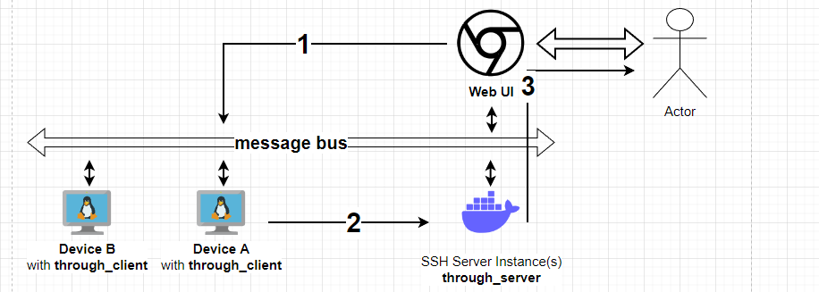

# Software to create SSH Tunnel / VPN / ETC
1. On Web UI, a user makes a request to create an SSH tunnel to Device A
    - Let's say port 22, 80

2. Device A receives a message through the message bus (such as MQTT / Kafka..)
    - Device performs remote port forwarding to the available ssh server

3. when the web receives a connection OK message, it notifies it to the user with...
    - connection is established or failed.
    - session expiration time (maybe 24H)
    - Provide a simple URL so the user can easily connect to Device A
        - port22.device_a.server.com
        - port80.device_a.server.com
        - Just need to find out how...
            - with a reverse proxy?
            - with something like go traefik or nginx? IDK!
            